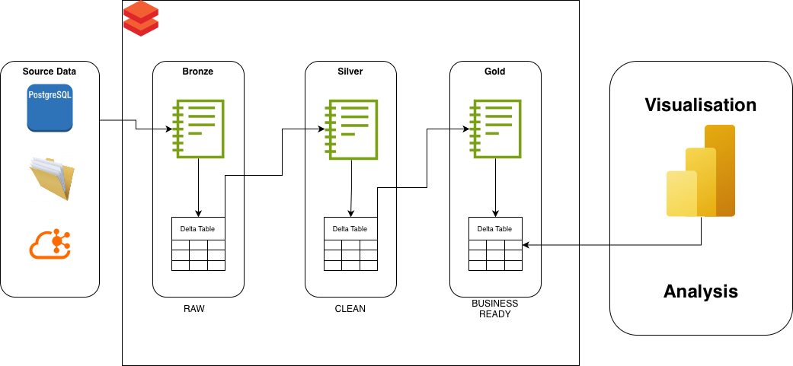

# databricks-lakehouse-e2e
End-to-end data engineering lakehouse using Databricks

## High-Level Architecture

This project implements an **end-to-end data engineering lakehouse architecture on Databricks**, following the **Medallion (Bronze, Silver, Gold)** pattern.

### Architecture Overview

The platform is designed to reflect real-world enterprise data platforms where data moves through multiple layers with increasing levels of structure and business readiness.

### Source Layer
Source data is simulated using **Databricks Catalog Volumes**, representing data landing from external systems such as:
- Object storage (S3 / ADLS)
- Batch exports from operational databases
- Files delivered by upstream applications

### Bronze Layer (Raw)
- Ingests data directly from the source Volume
- Stores raw, append-only data with ingestion metadata
- No business transformations applied
- Implemented using Delta tables for scalability and auditability

### Silver Layer (Clean & Conformed)
- Cleans and standardises raw data
- Handles null values, whitespaces, and inconsistent formatting
- Applies deduplication and data quality rules
- Produces structured, analytics-ready datasets

### Gold Layer (Business-Ready)
- Contains curated datasets optimised for analytics
- Includes aggregated metrics and business logic
- Serves as the consumption layer for reporting and dashboards

### Analysis & Visualisation
- Gold layer tables are consumed for analysis and reporting
- Supports BI tools such as Power BI
