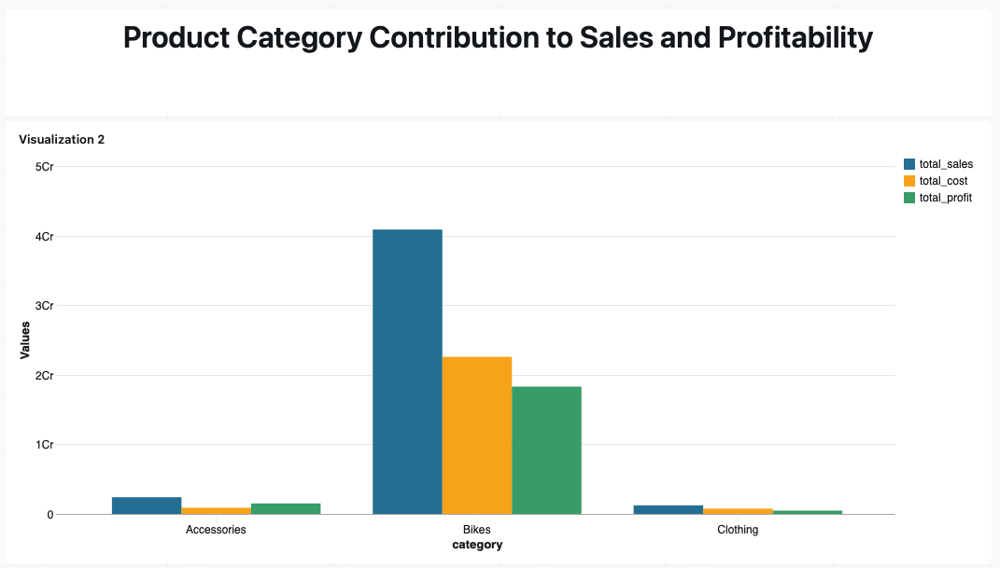

# databricks-lakehouse-e2e
End-to-end data engineering lakehouse using Databricks

## High-Level Architecture

This project implements an **end-to-end data engineering lakehouse architecture on Databricks**, following the **Medallion (Bronze, Silver, Gold)** pattern.

## Source Data

The project uses multiple raw CSV files representing operational data from different source systems within a retail sales domain. Each file is treated as an independent upstream data source and ingested without modification.

The raw datasets include:

- **Customer master data** containing customer identifiers, names, demographic attributes, and creation dates
- **Supplementary customer attributes** provided by external systems, including date of birth, gender, and geographic information
- **Product master data** containing product identifiers, names, cost information, product line classifications, and effective date ranges
- **Sales transaction data** capturing order-level details such as order dates, shipping dates, quantities, prices, and sales amounts
- **Product category reference data** defining product categories, subcategories, and maintenance attributes

The source data exhibits common real-world characteristics, including:
- Inconsistent identifier formats across systems
- Mixed date representations
- Missing or null values in numeric fields
- Inconsistent categorical values
- Multiple files contributing to a single business entity

To simulate real-world ingestion patterns, all raw files are first placed into a **Databricks Catalog Volume** and then ingested into the Bronze layer without applying business transformations.

### Source Layer
Source data is simulated using **Databricks Catalog Volumes**, representing data landing from external systems such as:
- Object storage (S3 / ADLS)
- Batch exports from operational databases
- Files delivered by upstream applications

### Bronze Layer (Raw)
- Ingests data directly from the source Volume
- Stores raw data exactly as received from the source
- No business transformations applied

### Silver Layer (Clean & Conformed)
- Cleans and standardises raw data
- Handles null values, whitespaces, and inconsistent formatting
- Applies deduplication and data quality rules
- Produces structured, analytics-ready datasets

### Gold Layer (Business-Ready)
- Contains curated datasets optimised for analytics
- Serves as the consumption layer for reporting and dashboards

### Analysis & Visualisation
- Gold layer tables are consumed for analysis and reporting

## Example Analysis – Product Category Contribution to Sales and Profitability (2013)

The Gold layer enables business-focused analysis by providing curated, aggregated metrics.  
An example analysis was performed to evaluate **product category contribution to sales and profitability for the year 2013**.

### Key Insights

- **Bikes dominate overall performance**, generating over **40M in total sales** and approximately **18.3M in profit**, making it the primary revenue and profit driver.
- **Accessories outperform Clothing in profitability**, despite lower total sales. Accessories generate around **1.5M in profit**, driven by a relatively higher margin compared to cost.
- **Clothing is the weakest performing category**, with the **lowest total sales and lowest profit (≈471K)** among all categories.
- Although Clothing shows a **similar average sales per order** to Accessories, its overall profitability is significantly lower, indicating inefficiencies in pricing, cost structure, or product mix.

### Business Interpretation

- The **Bikes category** represents a stable and high-impact segment and should continue to be a core focus.
- The **Accessories category** demonstrates strong margin potential and may benefit from increased investment or targeted growth strategies.
- The **Clothing category is underperforming** and requires further investigation into:
  - Pricing strategy
  - Cost optimisation
  - Supplier or production costs
  - Marketing effectiveness

### Outcome

This analysis highlights how **Gold layer datasets enable actionable business insights**, supporting data-driven decision-making across product strategy, pricing, and profitability optimisation.
